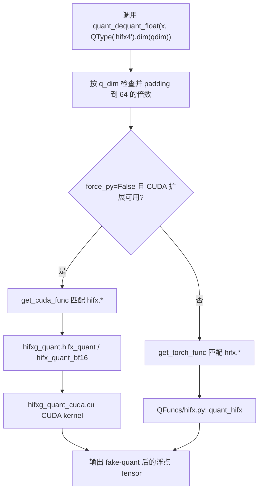
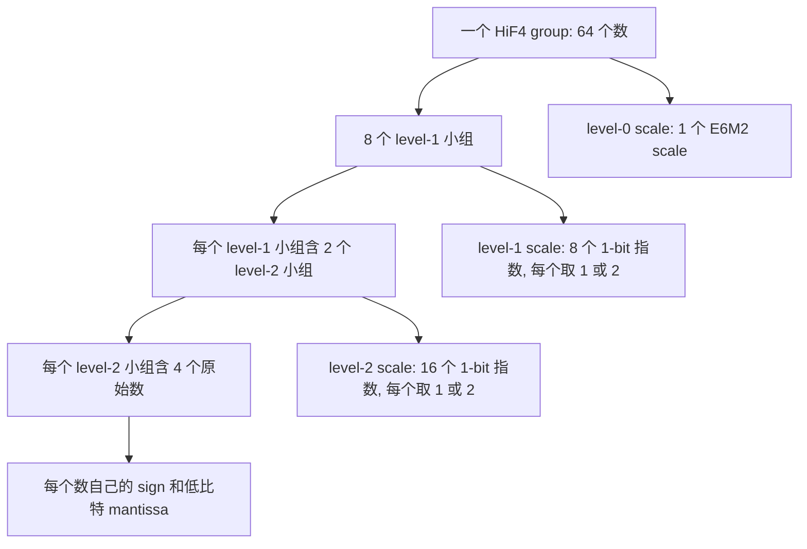
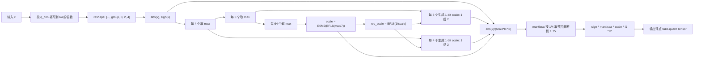

# HiF4 GPU 量化流程说明

本文只梳理 `HiFloat4/hif4_gpu` 中的 HiF4 fake quant 实现。

这里的 HiF4 在代码里主要叫 `hifx4`，不是 `hif4`。调用时应使用：

```python
QType("hifx4")
```

它做的是“量化后立即反量化”，输出仍然是浮点 Tensor，不是把数据真正打包成 4-bit 存储。

## 代码入口

主入口：

```text
HiFloat4/hif4_gpu/quant_cy/base/QTensor.py
```

核心调用链：



对应代码：

```python
# HiFloat4/hif4_gpu/quant_cy/base/QTensor.py

QFUNC_MAP = (
    (r'^int8sym$', quant_int8sym),
    (r'^hifx[0-9]*$', quant_hifx),
    (r'^nvf4$', quant_nvf4),
)

CUDA_KERNELS = (
    ...
    (r'^hifx[0-9]*$', (
        hifxg_quant.hifx_quant,
        hifxg_quant.hifx_quant_bf16,
        None,
    )),
)

if (not force_py) and (f := get_cuda_func(x, Q)):
    out = f(x)
else:
    out = get_torch_func(x, Q, qdim)(x)
```

CUDA 扩展构建入口：

```text
HiFloat4/hif4_gpu/build.sh
HiFloat4/hif4_gpu/quant_cy/base/cusrc/setup.py
```

## QType 参数展开

`QType("hifx4")` 会被展开成：

```text
e0m3K1k4B1b64Coff38
```

对应代码：

```python
# HiFloat4/hif4_gpu/quant_cy/base/QType.py

elif desc.lower()[:4] == 'hifx':
    res = re.match(r'^hifx([2345])$', desc.lower())
    n_bit_tmp = int(res.group(1)) - 1
    desc = 'e0m%dK1k4B1b%dCoff38' % (n_bit_tmp, 64)
```

对 `hifx4` 来说：

```text
exp_bits = 0
man_bits = 3
blk_outer_size = 1
blk_size = 64
```

也就是每 64 个数作为一个 HiF4 量化组。

## 量化组结构

Python 实现中先把量化维度拆成：

```python
x = x.unflatten(qdim, (-1, 8, 2, 4))
```

这表示每个 64 元素组被分成：

```text
64 = 8 * 2 * 4
```

结构图：



更具体地说：

```text
64 个数
  -> 16 组，每组 4 个数，计算 V16/max_lv3
  -> 8 组，每组 8 个数，计算 V8/max_lv2
  -> 1 组，每组 64 个数，计算 Vmax/max_lv1
```

## Python 版完整流程

代码位置：

```text
HiFloat4/hif4_gpu/quant_cy/base/QFuncs/hifx.py
```

核心代码：

```python
def quant_hifx(x, Q, qdim):
    x = x.unflatten(qdim, (-1, 8, 2, 4))
    x_unsigned = torch.abs(x)
    sign = torch.sign(x)

    max_lv3 = torch.max(x_unsigned, dim=qdim, keepdim=True)[0]
    max_lv2 = torch.max(max_lv3, dim=qdim - 1, keepdim=True)[0]
    max_lv1 = torch.max(max_lv2, dim=qdim - 2, keepdim=True)[0]

    div7 = torch.ones_like(max_lv1) / 7.0
    div7 = div7.to(torch.bfloat16).to(x.dtype)
    scale_factor = max_lv1 * div7
    scale_factor = scale_factor.to(torch.bfloat16).to(x.dtype).clip(
        min=2 ** (-48),
        max=49152,
    )

    e_sf = torch.floor(torch.log2(scale_factor))
    mant_sf = scale_factor / 2 ** e_sf * 2 ** 7
    scale_factor = torch.round(mant_sf) / 2 ** 7 * 2 ** e_sf

    e_sf = torch.floor(torch.log2(scale_factor))
    scale_factor = torch.round(scale_factor * torch.exp2(2 - e_sf)) * torch.exp2(e_sf - 2)

    rec_sf = (1.0 / scale_factor).to(torch.bfloat16).to(x.dtype)
    scale_lv2 = max_lv2 * rec_sf
    scale_lv2 = torch.exp2((scale_lv2.clip(0, 4) / 4).floor())
    scale_lv3 = torch.exp2(((max_lv3 * rec_sf / scale_lv2).clip(0, 2) / 2).floor())

    mant = x_unsigned / scale_lv2 / scale_lv3 * rec_sf
    mant = torch.floor(mant * 2 ** (Q.man_bits - 1) + 0.5) / 2 ** (Q.man_bits - 1)
    mant[mant >= 2] = 2 - 2 ** (-Q.man_bits + 1)

    out = sign * mant * scale_lv2 * scale_lv3 * scale_factor
    out = out.flatten(qdim - 3, qdim)
    return out
```

### 第一步：分组

输入沿 `q_dim` 方向按 64 个数一组。

```python
x = x.unflatten(qdim, (-1, 8, 2, 4))
```

如果原始维度不是 64 的倍数，`quant_dequant_float` 会先补 0，量化完再切回原始长度。

### 第二步：取绝对值和符号

```python
x_unsigned = torch.abs(x)
sign = torch.sign(x)
```

后续只对绝对值做量化，最后再乘回符号。

### 第三步：分层取最大值

```python
max_lv3 = torch.max(x_unsigned, dim=qdim, keepdim=True)[0]
max_lv2 = torch.max(max_lv3, dim=qdim - 1, keepdim=True)[0]
max_lv1 = torch.max(max_lv2, dim=qdim - 2, keepdim=True)[0]
```

含义：

```text
max_lv3: 每 4 个数一个最大值，共 16 个
max_lv2: 每 8 个数一个最大值，共 8 个
max_lv1: 每 64 个数一个最大值，共 1 个
```

### 第四步：计算 level-0 scale

HiF4 用 7 作为组内最大可表示值，所以：

```text
scale_factor = max_abs / 7
```

代码里不是直接用 FP32 scale，而是模拟硬件：

1. `1 / 7` 先转成 BF16。
2. `max_abs * BF16(1/7)` 后再转 BF16。
3. scale 限制在 `[2^-48, 49152]`。
4. scale 再量化成 `E6M2`。

公式：

```text
sf0 = BF16(max_abs * BF16(1/7))
sf1 = clip(sf0, 2^-48, 49152)
scale_factor = E6M2(sf1)
```

### 第五步：计算两级 1-bit scale

先取倒数：

```python
rec_sf = BF16(1 / scale_factor)
```

level-1 scale：

```python
scale_lv2 = torch.exp2((scale_lv2.clip(0, 4) / 4).floor())
```

这行结果只有两种：

```text
max_lv2 * rec_sf < 4  -> scale_lv2 = 1
max_lv2 * rec_sf >= 4 -> scale_lv2 = 2
```

level-2 scale：

```python
scale_lv3 = torch.exp2(((max_lv3 * rec_sf / scale_lv2).clip(0, 2) / 2).floor())
```

结果也只有两种：

```text
max_lv3 * rec_sf / scale_lv2 < 2  -> scale_lv3 = 1
max_lv3 * rec_sf / scale_lv2 >= 2 -> scale_lv3 = 2
```

所以每个数最终共享的 scale 是：

```text
effective_scale = scale_factor * scale_lv2 * scale_lv3
```

其中：

```text
scale_factor: 每 64 个数 1 个
scale_lv2: 每 8 个数 1 个，取 1 或 2
scale_lv3: 每 4 个数 1 个，取 1 或 2
```

### 第六步：量化每个数的 mantissa

先归一化：

```python
mant = abs(x) / scale_lv2 / scale_lv3 / scale_factor
```

代码为了减少除法，写成：

```python
mant = x_unsigned / scale_lv2 / scale_lv3 * rec_sf
```

对 `hifx4`：

```text
Q.man_bits = 3
Q.man_bits - 1 = 2
```

所以 mantissa 以 `1/4` 为步长取整：

```python
mant = floor(mant * 4 + 0.5) / 4
```

然后截断到最大：

```text
mant < 2
max mant = 2 - 2^-2 = 1.75
```

也就是可表示的非负 mantissa 大致是：

```text
0, 0.25, 0.5, 0.75, 1.0, 1.25, 1.5, 1.75
```

### 第七步：反量化

```python
out = sign * mant * scale_lv2 * scale_lv3 * scale_factor
```

这就是最终返回的 fake-quant 浮点值。

完整公式：

```text
q(x) = sign(x)
     * round_to_step_1/4(
           abs(x) / (scale_factor * scale_lv2 * scale_lv3)
       )
     * scale_factor
     * scale_lv2
     * scale_lv3
```

其中 round 后的 mantissa 会被截断到最大 `1.75`。

## CUDA 版流程

代码位置：

```text
HiFloat4/hif4_gpu/quant_cy/base/cusrc/hifxg_quant_cuda.cu
```

CUDA kernel 的核心函数：

```cpp
template <int N>
__device__ void hifx_quant_cuda_inner(
    float* x_shared,
    float* res_shared,
    const int& thread_idx
)
```

关键代码：

```cpp
float lv3[64], lv2[16], lv1[8], lv0;

for (int i = 0; i < 64; ++i) {
    lv3[i] = x_shared[thread_idx * 64 + i];
}

for (int i = 0; i < 16; ++i) {
    lv2[i] = abs(lv3[i * 4]);
    for (int j = 1; j < 4; ++j) {
        float e = abs(lv3[i * 4 + j]);
        if (e > lv2[i]) {
            lv2[i] = e;
        }
    }
}

for (int i = 0; i < 8; ++i) {
    lv1[i] = (lv2[i * 2] > lv2[i * 2 + 1]) ? lv2[i * 2] : lv2[i * 2 + 1];
}

lv0 = lv1[0];
for (int i = 1; i < 8; ++i) {
    lv0 = (lv0 < lv1[i]) ? lv1[i] : lv0;
}

float inv7 = f32_to_bf16(1.0f / 7.0f);
lv0 = lv0 * inv7;
lv0 = (lv0 > 49152.0f) ? 49152.0f : lv0;
lv0 = (lv0 < pow(2.0f, -48.0f)) ? pow(2.0f, -48.0f) : lv0;
lv0 = f32_to_bf16(lv0);
lv0 = f32_to_e6m2(lv0);

float rec_lv0 = f32_to_bf16(1.0f / lv0);

for (int i = 0; i < 8; ++i) {
    lv1[i] = lv1[i] * rec_lv0;
    lv1[i] = (lv1[i] >= 4.0f) ? 2.0f : 1.0f;
}

for (int i = 0; i < 16; ++i) {
    lv2[i] = lv2[i] / lv1[i / 2] * rec_lv0;
    lv2[i] = (lv2[i] >= 2.0f) ? 2.0f : 1.0f;
    lv2[i] = lv1[i / 2] * lv2[i];
}

for (int i = 0; i < 16; ++i) {
    lv3[i * 4 + 0] = round_mant<N>(lv3[i * 4 + 0], lv2[i], rec_lv0, lv0);
    lv3[i * 4 + 1] = round_mant<N>(lv3[i * 4 + 1], lv2[i], rec_lv0, lv0);
    lv3[i * 4 + 2] = round_mant<N>(lv3[i * 4 + 2], lv2[i], rec_lv0, lv0);
    lv3[i * 4 + 3] = round_mant<N>(lv3[i * 4 + 3], lv2[i], rec_lv0, lv0);
}
```

CUDA 版和 Python 版变量对应关系：

| Python 变量 | CUDA 变量 | 含义 |
|---|---|---|
| `max_lv3` | `lv2[16]` 初始值 | 每 4 个数的最大绝对值 |
| `max_lv2` | `lv1[8]` 初始值 | 每 8 个数的最大绝对值 |
| `max_lv1` | `lv0` 初始值 | 每 64 个数的最大绝对值 |
| `scale_factor` | `lv0` 量化后 | 每 64 个数一个 E6M2 scale |
| `rec_sf` | `rec_lv0` | scale 的 BF16 倒数 |
| `scale_lv2` | `lv1[i]` 量化后 | 每 8 个数一个 1-bit scale |
| `scale_lv3` | `lv2[i] / lv1[i/2]` 判断后 | 每 4 个数一个 1-bit scale |
| `mant` | `round_mant<N>` 内部 | 每个数的低比特 mantissa |

CUDA 版每个 thread 处理一组 64 个数：

```cpp
int threads = 4096 / 2 / 32;  // 64
int blocks = (x.numel() + 4095) / 4096;
```

也就是每个 CUDA block 处理：

```text
64 threads * 64 values = 4096 values
```

## hifx4 的 N 参数

Python 入口调用 CUDA 时会传一个 `N`：

```python
if Q.desc[:4] == 'hifx':
    if Q.exp_bits == 0:
        func(x2, out, Q.man_bits - 1)
```

对 `hifx4`：

```text
Q.man_bits = 3
N = Q.man_bits - 1 = 2
```

CUDA 中：

```cpp
if (N == 2) {
    hifx_quant_cuda_kernel<2><<<blocks, threads>>>(...);
}
```

所以 `round_mant<2>` 表示按 `1 / 2^2 = 1/4` 的步长量化 mantissa。

## 数据流总结图



## 和 NVF4 的区别

你当前打开的 `nvf4.py` 是 NVFP4，不是 HiF4。

NVF4：

```text
每 16 个数一组
scale = E4M3(max(abs(x)) / 6)
组内值 = E2M1(abs(x) / scale)
输出 = sign * scale * E2M1
```

HiF4：

```text
每 64 个数一组
scale = E6M2(BF16(max(abs(x)) / 7))
每 8 个数再有 1-bit scale
每 4 个数再有 1-bit scale
组内 mantissa 按 1/4 量化，最大 1.75
输出 = sign * scale64 * scale8 * scale4 * mantissa
```

## QLinear 中的使用方式

位置：

```text
HiFloat4/hif4_gpu/quant_cy/layers/QLinear.py
```

前向传播中会先 fake quant 输入和权重：

```python
x_q = quant_dequant_float(x, qp_in, force_fp32=True)
w_q = quant_dequant_float(w, qp, force_fp32=True)
out = F.linear(x_q, w_q, b)
```

所以 Linear 计算本身仍然是 PyTorch 的 `F.linear`，量化误差来自进入 matmul 前的 fake-quant 张量。

## 注意点

1. 默认优先走 CUDA。

   只要 CUDA 扩展 import 成功，并且没有传 `force_py=True`，`quant_dequant_float` 会走 CUDA kernel。

2. `float16` 没有专门的 HiF4 CUDA kernel。

   `CUDA_KERNELS` 中 hifx 的第三项是 `None`。如果输入是 `float16`，代码会临时转成 `float32` 跑 CUDA，再转回原 dtype。

3. 代码中有 `qp.desc == 'hif4'` 的判断，但 `QType` 实际支持的是 `hifx4`。

   例如 `QLinear.py` 里：

   ```python
   if qp.desc == 'hif4':
       ...
   ```

   如果实际使用 `QType("hifx4")`，这些分支不会触发。

4. 这里没有真正 packed 4-bit。

   `quant_dequant_float` 返回的是 fake-quant 后的浮点值。它模拟 HiF4 数值误差，但不是压缩存储格式。

