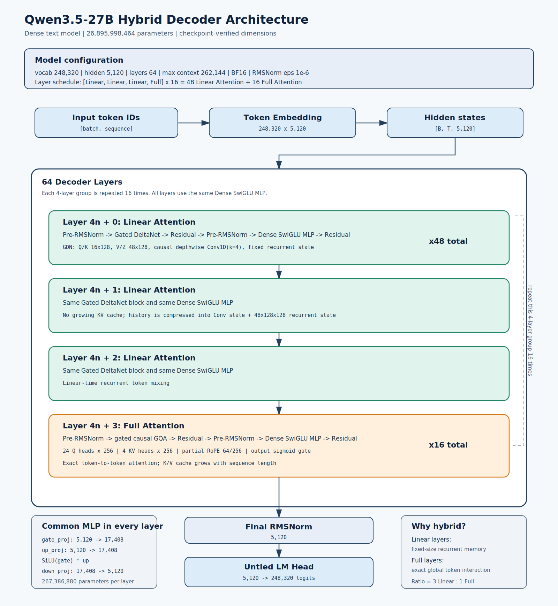
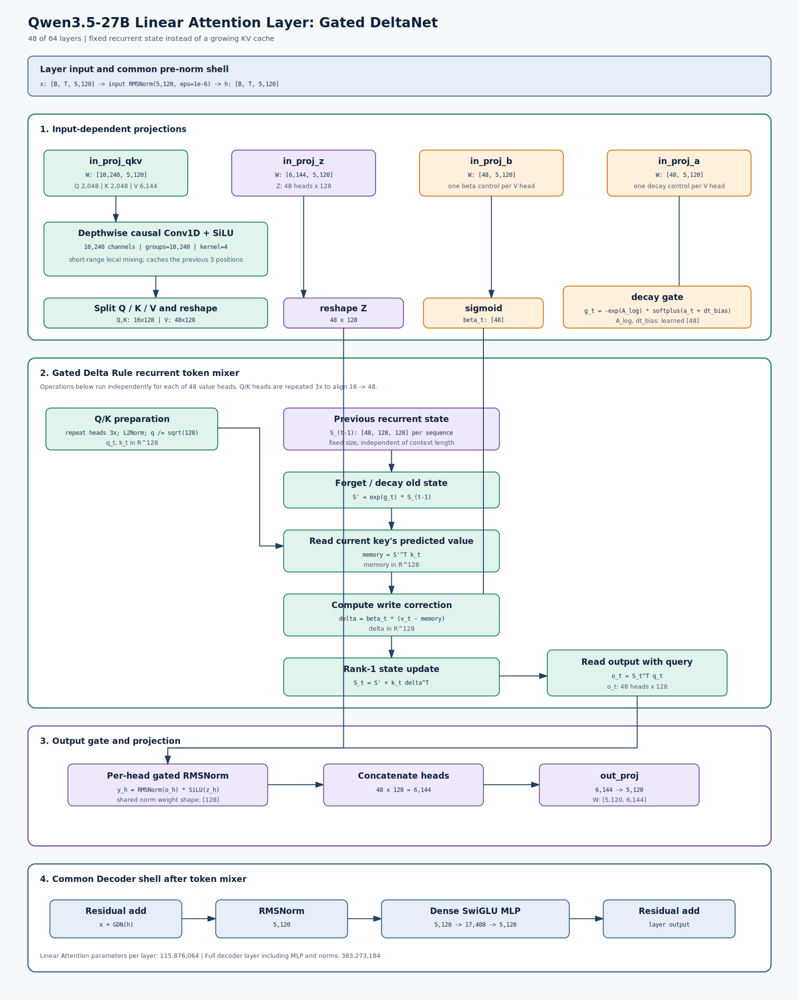
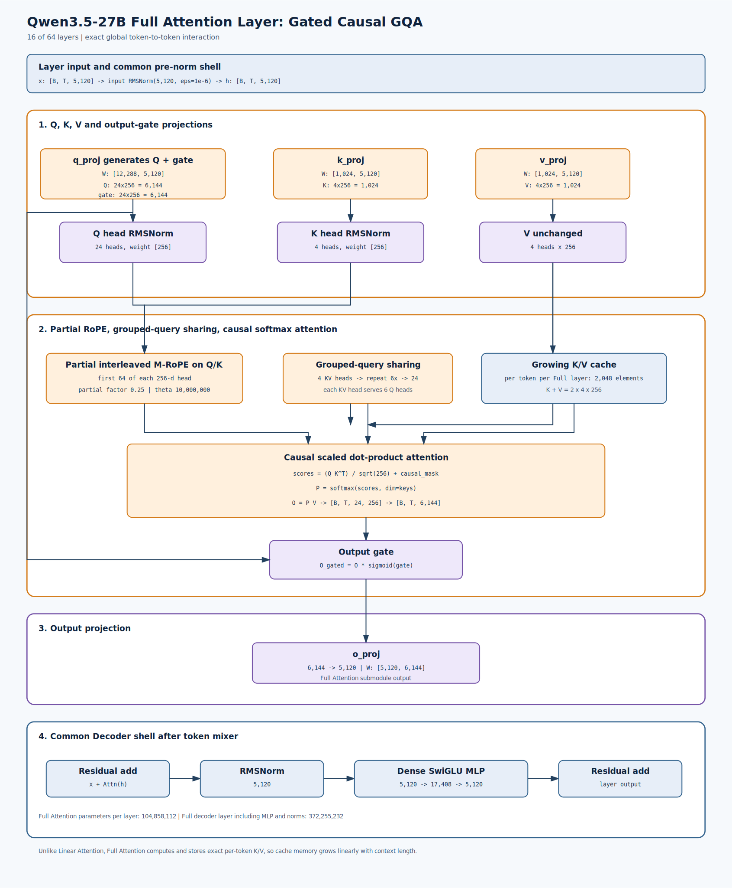

# Qwen3.5-27B 混合架构说明

这份说明和架构图基于当前仓库中的
`Qmodel/Qwen3.5-27B-HiF4-RTN/config.json`、checkpoint 权重形状、
Transformers 5.8.1 的 `modeling_qwen3_5.py`，以及仓库内 vLLM Qwen3.5 实现。



## 核心结论

- 这是 **Dense 纯文本 Decoder-only 模型**，不是 MoE。
- 精确参数量：`26,895,998,464`，即约 `26.90B`。
- `64` 个 Decoder Layer，隐藏维度 `5120`。
- 层排列固定为 `[Linear, Linear, Linear, Full] x 16`：
  - `48` 个 Linear Attention 层。
  - `16` 个 Full Attention 层。
- 每层 Attention 类型不同，但 MLP 和残差外框完全相同：
  `RMSNorm -> Token Mixer -> Residual -> RMSNorm -> SwiGLU MLP -> Residual`。
- 每层都有 Dense SwiGLU MLP：`5120 -> 17408 -> 5120`。
- 最大位置长度为 `262144` tokens。

## Linear Attention 细节



Linear Attention 实际是 **Gated DeltaNet**，不是普通的
`softmax(QK^T)V`。它把历史压缩进每个 value head 的递归状态
`S_t in R^(128 x 128)`。

输入投影：

- `Q`: `16 x 128 = 2048`
- `K`: `16 x 128 = 2048`
- `V`: `48 x 128 = 6144`
- `Z`: `48 x 128 = 6144`，用于最终输出门控
- `a`, `b`: 各 `48` 个标量，每个 value head 一个

`Q/K/V` 先经过 kernel size 为 `4` 的 depthwise causal Conv1D 和
SiLU。然后 Q/K 从 `16` heads 重复为 `48` heads，与 V 对齐，并对 Q/K
做 L2 normalization。

每个 token、每个 head 的递归更新可写成：

```text
beta_t = sigmoid(b_t)
g_t    = -exp(A_log) * softplus(a_t + dt_bias)

S_t    = exp(g_t) * S_(t-1)
memory = S_t^T k_t
delta  = beta_t * (v_t - memory)
S_t    = S_t + k_t delta^T
o_t    = S_t^T (q_t / sqrt(128))
```

之后执行 `RMSNorm(o_t) * SiLU(z_t)`，拼接 48 个 heads 得到 `6144`，
再通过 `out_proj: 6144 -> 5120`。

Linear Attention 的缓存不是随序列增长的 KV Cache，而是固定大小状态：

- Conv state：保留最近 `kernel_size - 1 = 3` 个位置。
- Recurrent state：每层每序列约为 `48 x 128 x 128` 个状态元素。

## Full Attention 细节



Full Attention 是带输出门控的 causal GQA：

- Query heads：`24`，每个 head `256` 维，总计 `6144`。
- KV heads：`4`，每个 head `256` 维，K/V 各 `1024`。
- 每个 KV head 被 `6` 个 Query heads 共享。
- `q_proj` 同时生成 Q 和输出 gate，因此权重形状为
  `[12288, 5120] = [2 x 6144, 5120]`。
- Q/K 先做逐 head RMSNorm。
- 只对每个 head 的前 `64 / 256` 维应用 partial RoPE，`rope_theta=1e7`。
- causal softmax attention 输出乘 `sigmoid(gate)` 后，再经过
  `o_proj: 6144 -> 5120`。

Full Attention 需要保存随序列长度增长的 K/V Cache：
每个 token、每个 Full Attention 层保存 `K + V = 2 x 4 x 256 = 2048`
个元素。

## 公共 MLP 与参数分布

每层 MLP 都是：

```text
gate = SiLU(gate_proj(x))     # 5120 -> 17408
up   = up_proj(x)             # 5120 -> 17408
out  = down_proj(gate * up)   # 17408 -> 5120
```

主要参数量：

| 模块 | 单层参数量 | 层数 | 合计 |
|---|---:|---:|---:|
| Linear Attention 子模块 | 115,876,064 | 48 | 5.56B |
| Full Attention 子模块 | 104,858,112 | 16 | 1.68B |
| Dense SwiGLU MLP | 267,386,880 | 64 | 17.11B |
| Token Embedding | 1,271,398,400 | 1 | 1.27B |
| LM Head（不与 Embedding 共享） | 1,271,398,400 | 1 | 1.27B |

MLP 占模型参数的大头。Linear Attention 的主要优势不是减少参数量，而是把
长上下文推理时不断增长的 KV Cache 改成固定大小递归状态；每隔 4 层插入的
Full Attention 则保留全局 token-to-token 精确交互。

